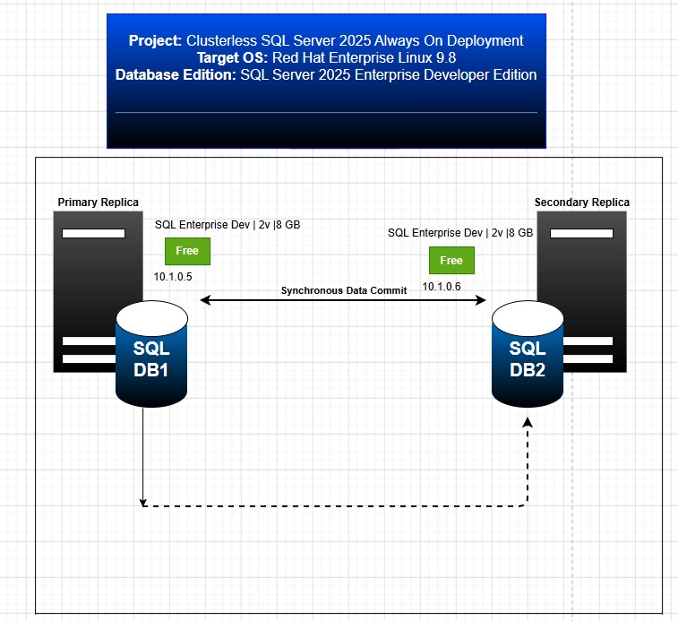
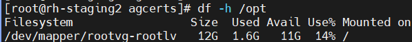
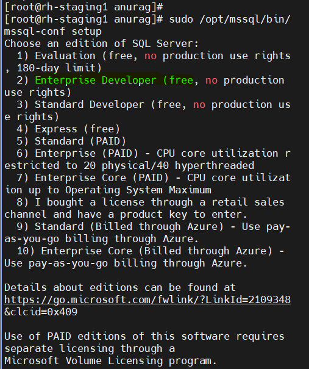
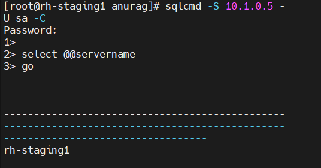
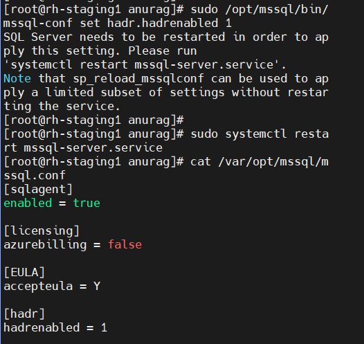
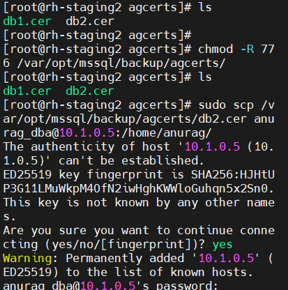
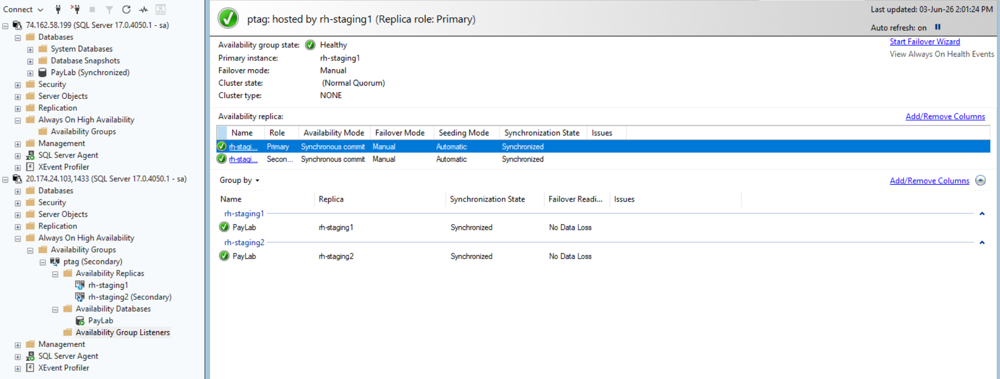
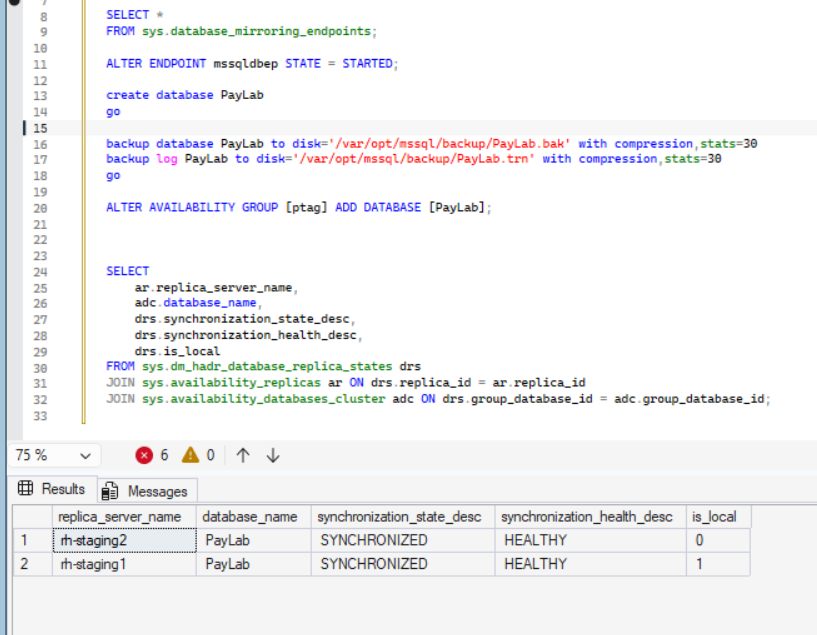

# 📑 Implementation Plan & Operational Runbook
🚀 **Production Blueprint for 2-Node Synchronous Read-Scale Availability Groups on RHEL 9.8**

* **Project:** Clusterless SQL Server 2025 Always On Deployment
* **Target OS:** Red Hat Enterprise Linux 9.8 (Plow Kernel)
* **Database Edition:** SQL Server 2025 Enterprise Developer Edition

---

## 🗺️ Architecture Overview: Read-Scale (Clusterless) Availability Group
This cluster topography enforces `CLUSTER_TYPE = NONE` to optimize database workloads directly at the SQL engine tier, removing clustering daemon overhead to drastically lower enterprise operating costs.

| Hostname | IP Address | Role | SQL Server Edition | OS Version |
| :--- | :--- | :--- | :--- | :--- |
| **rh-staging1** | 10.1.0.5 | Primary Node | Enterprise Developer 2025 | RHEL 9.8 |
| **rh-staging2** | 10.1.0.6 | Secondary Node | Enterprise Developer 2025 | RHEL 9.8 |



---

## 🎛️ 1. Environment Details & System Resource Matrix
Hardware specifications and system metrics extracted from active lab environments:

| Server Name | OS Version | CPU Cores | Memory RAM | Total Storage |
| :--- | :--- | :--- | :--- | :--- |
| **rh-staging1** | Red Hat Enterprise Linux 9.8 | 4 Cores | 15 GiB | 88.4 GB |
| **rh-staging2** | Red Hat Enterprise Linux 9.8 | 2 Cores | 7.4 GiB | 67.4 GB |

### 🖥️ PRIMARY NODE: rh-staging1 (10.1.0.5) Resource Profile
* **[💾 Compute Resources]**
  - CPU Allocation: 4 Cores (x86_64)
  - Memory Footprint: Total: 15 GiB | Used: 1.8 GiB | Free: 7.0 GiB (Available: 13 GiB)
  - Swap Space Allocation: 0 B
* **[🗄️ Storage Allocation (df -h)]**
  - `/` (Root File System): Size: 12G | Used: 1.6G | Avail: 11G | Use%: 14%
  - `/var` (/var/opt/mssql): Size: 15G | Used: 844M | Avail: 15G | Use%: 6%
  - `/usr` (/usr/bin): Size: 15G | Used: 4.7G | Avail: 11G | Use%: 32%
  - `/home`: Size: 11G | Used: 114M | Avail: 11G | Use%: 2%

### 🖥️ SECONDARY NODE: rh-staging2 (10.1.0.6) Resource Profile
* **[💾 Compute Resources]**
  - CPU Allocation: 2 Cores (Intel Xeon Platinum 8370C @ 2.80GHz)
  - Memory Footprint: Total: 7.4 GiB | Used: 1.4 GiB | Free: 4.0 GiB (Available: 6.1 GiB)
  - Swap Space Allocation: 0 B
* **[🗄️ Storage Allocation (df -h)]**
  - `/` (Root File System): Size: 12G | Used: 1.6G | Avail: 11G | Use%: 14%
  - `/var` (/var/opt/mssql): Size: 15G | Used: 818M | Avail: 15G | Use%: 6%
  - `/usr` (/usr/bin): Size: 15G | Used: 2.2G | Avail: 13G | Use%: 15%


---

## 🛠️ 2. Hostname Allocation & OS Firewall Setup

### Step 2.1: Enforce System Identities
Execute on your respective server nodes to lock down host identifiers:
```bash
# On Node 1
sudo hostnamectl set-hostname rh-staging1

# On Node 2
sudo hostnamectl set-hostname rh-staging2
```

### Step 2.2: Apply Local Network Mapping
Modify your local resolution maps via `vi` on both servers:
```bash
sudo vi /etc/hosts
```
Add the static routing entries:
```text
10.1.0.5   rh-staging1
10.1.0.6   rh-staging2
```

### Step 2.3: Port Routing & Firewall Policy
*Note: Because `CLUSTER_TYPE = NONE` handles replication directly at the SQL engine tier, cluster ports (2224, 3121, 21064, 5405) are omitted by design here, though they remain necessary for clustered orchestrations.*

Open active listener ports across your `firewalld` perimeter layers on both nodes:
```bash
# Allow Database Engine connection traffic
sudo firewall-cmd --permanent --add-port=1433/tcp

# Allow Always On Data Mirroring Endpoint traffic
sudo firewall-cmd --permanent --add-port=5022/tcp

# Refresh and enforce active firewall rules
sudo firewall-cmd --reload

# Install pipeline validation toolsets
sudo dnf install -y telnet nc
```

### Step 2.4: Network Security Verification
Execute cross-node link validation checks to prove route integrity:
```bash
# 1. ICMP Ping Test (Run from either node to test line quality)
ping -c 3 10.1.0.5
ping -c 3 10.1.0.6

# 2. Port Validation (Run from rh-staging2 to rh-staging1)
telnet 10.1.0.5 1433
telnet 10.1.0.5 5022  

# 3. Port Validation (Run from rh-staging1 to rh-staging2)
telnet 10.1.0.6 1433
telnet 10.1.0.6 5022  
```

---

## 🗄️ 3. Storage Allocation & Disk Preparation
Decoupling independent directory trees isolates sequential transaction logging pipelines from random data disk reads.

### Step 3.1: Directory Tree & Hardened Access
Execute on both endpoints to configure high-throughput volume targets:
```bash
# Create segregated data and transaction log directories
sudo mkdir -p /var/opt/mssql/sql-data
sudo mkdir -p /var/opt/mssql/sql-tlog
sudo mkdir -p /var/opt/mssql/sql-tempdb
sudo mkdir -p /var/opt/mssql/backup/agcerts

# Reassign filesystem ownership to the service worker daemon
sudo chown -R mssql:mssql /var/opt/mssql/sql-data
sudo chown -R mssql:mssql /var/opt/mssql/sql-tlog
sudo chown -R mssql:mssql /var/opt/mssql/sql-tempdb
sudo chown -R mssql:mssql /var/opt/mssql/backup

# Strip broad group/public directory exposure (Security Hardening)
sudo chmod -R 700 /var/opt/mssql/sql-data
sudo chmod -R 700 /var/opt/mssql/sql-tlog
sudo chmod -R 700 /var/opt/mssql/sql-tempdb
sudo chmod -R 700 /var/opt/mssql/backup
```

### Step 3.2: Map SELinux Policies
Enforce strict kernel-level labeling regulations to ensure access to non-standard database structures remains unblocked:
```bash
# Register directories to the SQL Database security context policies
sudo semanage fcontext -a -t mssql_db_t "/var/opt/mssql/sql-data(/.*)?"
sudo semanage fcontext -a -t mssql_db_t "/var/opt/mssql/sql-tlog(/.*)?"
sudo semanage fcontext -a -t mssql_db_t "/var/opt/mssql/sql-tempdb(/.*)?"
sudo semanage fcontext -a -t mssql_db_t "/var/opt/mssql/backup(/.*)?"

# Force recursive context refreshes across target paths
sudo restorecon -R -v /var/opt/mssql/sql-data
sudo restorecon -R -v /var/opt/mssql/sql-tlog
sudo restorecon -R -v /var/opt/mssql/sql-tempdb
sudo restorecon -R -v /var/opt/mssql/backup
```

---

## 📦 4. SQL Server 2025 Installation

### Step 4.1: OS Upgrades & Repository Registration
The SQL Server 2025 SELinux security module relies on system libraries introduced in RHEL 9.7/9.8. Running older 9.4 builds will result in dependency breaks during installation.

Execute on both nodes:
```bash
# Clear older cache matrices and pull latest package manifests
sudo dnf clean all
sudo dnf update -y
```
Verify system release level matches design specifications:
```bash
cat /etc/redhat-release  
```


### Step 4.2: Space Warning (Root Directory Verification)
SQL Server installs foundational library binaries directly into `/opt/mssql`. Ensure your `/` partition has a minimum of 10 GB available space before executing:
```bash
df -h /opt
```


### Step 4.3: Microsoft Repository Registration
Register the official package distribution channel across both staging nodes:
```bash
sudo curl -o /etc/yum.repos.d/mssql-server.repo https://microsoft.com
sudo curl -o /etc/yum.repos.d/mssql-release.repo https://microsoft.com
```

### Step 4.4: Install Engine Binaries
With RHEL updated to 9.8, the `mssql-server-selinux` dependency maps cleanly without requiring loose permissive configuration flags. Run on both servers:
```bash
sudo dnf install -y mssql-server mssql-server-selinux
```

### Step 4.5: SQL Instance Initialization
Invoke the local configuration script to select licensing profiles and establish system keys:
```bash
sudo /opt/mssql/bin/mssql-conf setup
```
* **Interactive Prompts Selection:** Choose option `2 (Enterprise Developer - Free for non-production environments)`.
* **Administrative Credentials:** Assign a strong complex password for the `sa` account.



### Step 4.6: Activate SQL Agent Service
Enable background modules and append binary paths to system environment variables:
```bash
# Enable automation engine features
sudo /opt/mssql/bin/mssql-conf set sqlagent.enabled true

# Bind utility paths to profile references
echo 'export PATH="\$PATH:/opt/mssql-tools18/bin"' >> ~/.bashrc
source ~/.bashrc

# Persist and initialize the database runtime engines
sudo systemctl enable mssql-server
sudo systemctl restart mssql-server
```
Verify instance baseline terminal connectivity:
```sql
sqlcmd -S localhost -U sa -C -Q "SELECT @@SERVERNAME;"
```


---

## 🚀 5. Always On Feature Activation, AG Provisioning & DB Sync

### Step 5.1: Enable HADR Core Engine Modules
Activate high availability extensions via terminal configurations across both servers:
```bash
sudo /opt/mssql/bin/mssql-conf set hadr.hadrenabled 1
sudo systemctl restart mssql-server
```
Verify the feature flags persist correctly inside your configuration files:
```bash
cat /var/opt/mssql/mssql.conf
```


### Step 5.2: Initialize Availability Group Definitions
Connect to the **Primary Server (rh-staging1)** via `sqlcmd` to generate structural database cryptographic master keys, certificates, and transport loops:
```sql
-- Establish cryptographic storage keys
USE master;
GO
CREATE MASTER KEY ENCRYPTION BY PASSWORD = 'YourStrongKeyPassword99!';
GO

-- Create Transport Layer Certificate
CREATE CERTIFICATE AG_Transport_Cert
WITH SUBJECT = 'Availability Group Replica Transport Authentication',
START_DATE = '2026-01-01', EXPIRY_DATE = '2035-01-01';
GO

-- Provision Network Handshake Connection Endpoints over Port 5022
CREATE ENDPOINT [Hadr_endpoint]
    STATE = STARTED
    AS TCP (LISTENER_PORT = 5022)
    FOR DATABASE_MIRRORING (
        ROLE = ALL,
        AUTHENTICATION = CERTIFICATE AG_Transport_Cert,
        ENCRYPTION = REQUIRED ALGORITHM AES
    );
GO
```

### Step 5.3: Export Primary Certificate Files
Back up the certificate key from the Primary database so it can be trusted by the secondary server:
```sql
BACKUP CERTIFICATE AG_Transport_Cert
TO FILE = '/var/opt/mssql/backup/agcerts/AG_Transport_Cert.cer'
WITH PRIVATE KEY (
    FILE = '/var/opt/mssql/backup/agcerts/AG_Transport_Cert.key',
    ENCRYPTION BY PASSWORD = 'YourStrongKeyPassword99!'
);
GO
```

### Step 5.4: Cross-Ship Public Security Keys
Transfer your authentication signatures over network boundaries via `scp` from `rh-staging1` to `rh-staging2`:
```bash
sudo scp /var/opt/mssql/backup/agcerts/AG_Transport_Cert.* root@10.1.0.6:/var/opt/mssql/backup/agcerts/
```
Once moved, jump to the **Secondary Server (rh-staging2)** to realign discretionary access authority permissions:
```bash
sudo chown -R mssql:mssql /var/opt/mssql/backup/agcerts/
sudo chmod 600 /var/opt/mssql/backup/agcerts/AG_Transport_Cert.*
```


### Step 5.5: Secondary Configuration
Connect to the **Secondary Server (rh-staging2)** to import primary security maps and initialize the mirrored database endpoint structure:
```sql
USE master;
GO

CREATE MASTER KEY ENCRYPTION BY PASSWORD = 'YourStrongKeyPassword99!';
GO

CREATE CERTIFICATE AG_Transport_Cert
FROM FILE = '/var/opt/mssql/backup/agcerts/AG_Transport_Cert.cer'
WITH PRIVATE KEY (
    FILE = '/var/opt/mssql/backup/agcerts/AG_Transport_Cert.key',
    DECRYPTION BY PASSWORD = 'YourStrongKeyPassword99!'
);
GO

CREATE ENDPOINT [Hadr_endpoint]
    STATE = STARTED
    AS TCP (LISTENER_PORT = 5022)
    FOR DATABASE_MIRRORING (
        ROLE = ALL,
        AUTHENTICATION = CERTIFICATE AG_Transport_Cert,
        ENCRYPTION = REQUIRED ALGORITHM AES
    );
GO
```

### Step 5.6: Initialize the Clusterless Availability Group Object
Connect to the **Primary Server (rh-staging1)** to create the read-scale logical AG:
```sql
CREATE AVAILABILITY GROUP [ptag]
WITH (CLUSTER_TYPE = NONE) -- Enforcing clusterless read-scale parameters
FOR REPLICA ON
    N'rh-staging1' WITH (
        ENDPOINT_URL = N'TCP://10.1.0.5:5022',
        AVAILABILITY_MODE = SYNCHRONOUS_COMMIT, -- Guaranteed zero data loss configuration
        FAILOVER_MODE = MANUAL,
        SEEDING_MODE = AUTOMATIC,
        SECONDARY_ROLE(ALLOW_CONNECTIONS = ALL)
    ),
    N'rh-staging2' WITH (
        ENDPOINT_URL = N'TCP://10.1.0.6:5022',
        AVAILABILITY_MODE = SYNCHRONOUS_COMMIT,
        FAILOVER_MODE = MANUAL,
        SEEDING_MODE = AUTOMATIC,
        SECONDARY_ROLE(ALLOW_CONNECTIONS = ALL)
    );
GO
```

### Step 5.7: Connect the Secondary Replica to the Pipeline
Connect to the **Secondary Server (rh-staging2)** and join the running session pipeline:
```sql
ALTER AVAILABILITY GROUP [ptag] JOIN WITH (CLUSTER_TYPE = NONE);
GO

-- Grant automatic restoration authority to allow auto-seeding
ALTER AVAILABILITY GROUP [ptag] GRANT CREATE ANY DATABASE;
GO
```

### Step 5.8: Add the Database to the Availability Group
On the **Primary Server (rh-staging1)**, create user workloads, switch recovery models, establish transactional tracking baselines, and inject the container into the synchronization pipeline:
```sql
CREATE DATABASE PayLab;
GO
ALTER DATABASE PayLab SET RECOVERY FULL; -- Always On Logging Mandate
GO

-- Take initial recovery log chain snapshots
BACKUP DATABASE PayLab TO DISK = '/var/opt/mssql/backup/PayLab.bak' WITH COMPRESSION, STATS = 30;
BACKUP LOG PayLab TO DISK = '/var/opt/mssql/backup/PayLab.trn' WITH COMPRESSION, STATS = 30;
GO

-- Append database container directly into synchronization streams
ALTER AVAILABILITY GROUP [ptag] ADD DATABASE [PayLab];
GO
```

Once joined, launch the SQL Server Management Studio (SSMS) panel to confirm database health:



---

## 📈 6. Operational Tracking & Monitoring Logs
Execute these monitoring shell diagnostics directly from a Linux bash terminal to verify running synchronization states and analyze pipeline exceptions:
```bash
# Check raw file-system events related to engine drops
tail -n 100 /var/opt/mssql/log/errorlog

# Read real-time engine-level AG exceptions
sudo grep -E "Database mirroring|Availability Groups" /var/opt/mssql/log/errorlog

# Read host operating system runtime errors
sudo journalctl -u mssql-server -n 50 --no-pager
```

---

## 🔍 7. Post-Deployment Validation Queries

### Check AG Replica Synchronisation States
Run this metadata query window block to confirm active operational replication across nodes:
```sql
SELECT 
    ar.replica_server_name, 
    adc.database_name, 
    drs.synchronization_state_desc, 
    drs.synchronization_health_desc,
    drs.is_local
FROM sys.dm_hadr_database_replica_states drs
JOIN sys.availability_replicas ar ON drs.replica_id = ar.replica_id
JOIN sys.availability_databases_cluster adc ON drs.group_database_id = adc.group_database_id;
```


### Check Automatic Seeding Progress Status
Verify underlying auto-restoration transaction metrics:
```sql
SELECT 
    start_time, 
    completion_time, 
    current_state, 
    performed_seeding, 
    failure_state_desc
FROM sys.dm_hadr_automatic_seeding;
```
